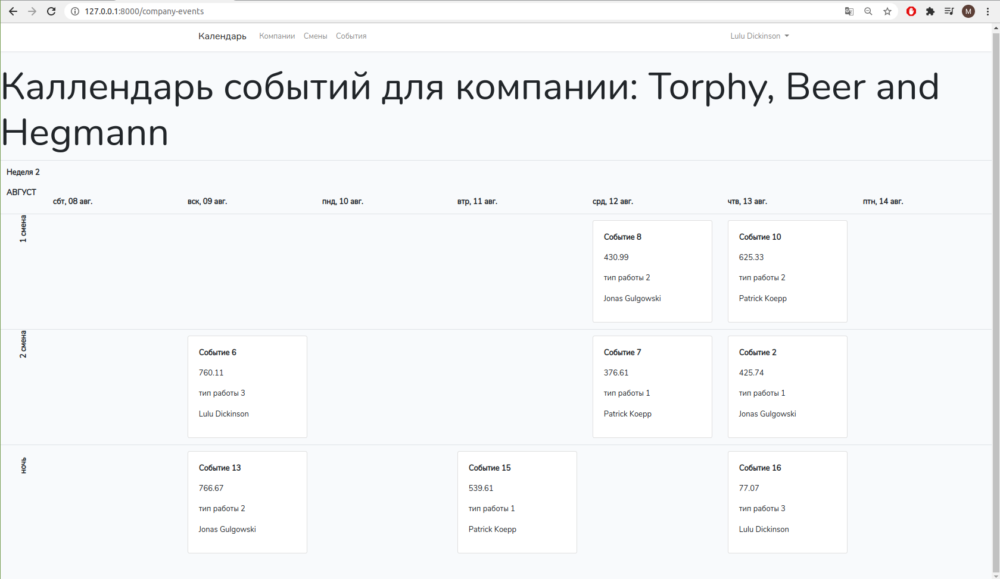

## Инструкции по разворачиванию проекта

1. Склонировать проект
2. Установить зависимости проекта. Перейти в папку приложения и выполнить команду `composer update`
3. Скопировать файл `.env.example` и переименовать в `.env`
4. В `.env` прописать парамерты соединения с базой данных
5. Выполнить команду генерации ключа приложения `php artisan key:generate`
6. Выполнить `php artisan migrate --seed`
7. Запустить локальный сервер (можно командой `php artisan serve`)

### Результат

